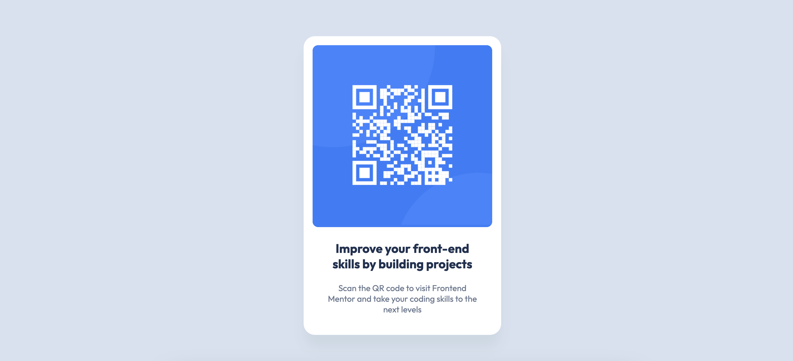
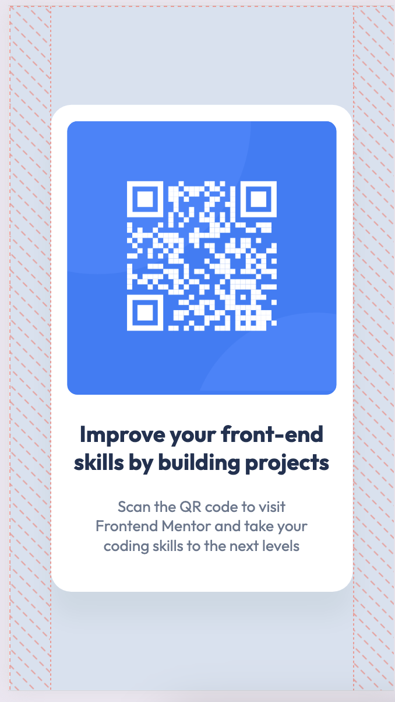

# Frontend Mentor - QR code component solution

This is a solution to the [QR code component challenge on Frontend Mentor](https://www.frontendmentor.io/challenges/qr-code-component-iux_sIO_H). Frontend Mentor challenges help you improve your coding skills by building realistic projects.

## Table of contents

- [Overview](#overview)
  - [Screenshot](#screenshot)
  - [Links](#links)
- [My process](#my-process)
  - [Built with](#built-with)
  - [What I learned](#what-i-learned)
  - [Continued development](#continued-development)
  - [Useful resources](#useful-resources)
- [Author](#author)
- [Acknowledgments](#acknowledgments)

**Note: Delete this note and update the table of contents based on what sections you keep.**

## Overview

### Screenshot

- mobile

- desktop

### Links

- Solution URL: [Add solution URL here](https://your-solution-url.com)
- Live Site URL: [Add live site URL here](https://your-live-site-url.com)

## My process

### Built with

- Semantic HTML5 markup
- CSS custom properties
- Flexbox
- Mobile-first workflow

### What I learned

I had to take a few times to understand media queries for responsive layout and I will continue learning about that. For now I have found out how to center vertically and horizontally the div in the ui using Flexbox. I am working this to apply what I have learned by doing this kind of projects.

### Continued development

I still need to learn about how to structure html tag element properly for both mobile and desktop version. Moreover, I will have to continue practicing responsive layout using media queries.

### Useful resources

- (https://www.w3schools.com/m) - This website helped me to understand about media queries and how it works.

## Author

- Github - [KhineKhineMyatNoe](https://github.com/KhineKhineMyatNoe)
- Frontend Mentor - [@yourusername](https://www.frontendmentor.io/profile/KhineKhineMyatNoe)

## Acknowledgments

I’m grateful to Frontend Mentor for offering this challenge and making it freely accessible. It’s a fantastic opportunity for people like me to apply the skills I’ve gained from tutorials and deepen my practical experience
